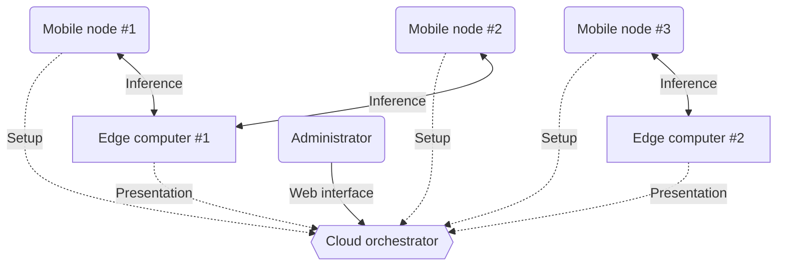
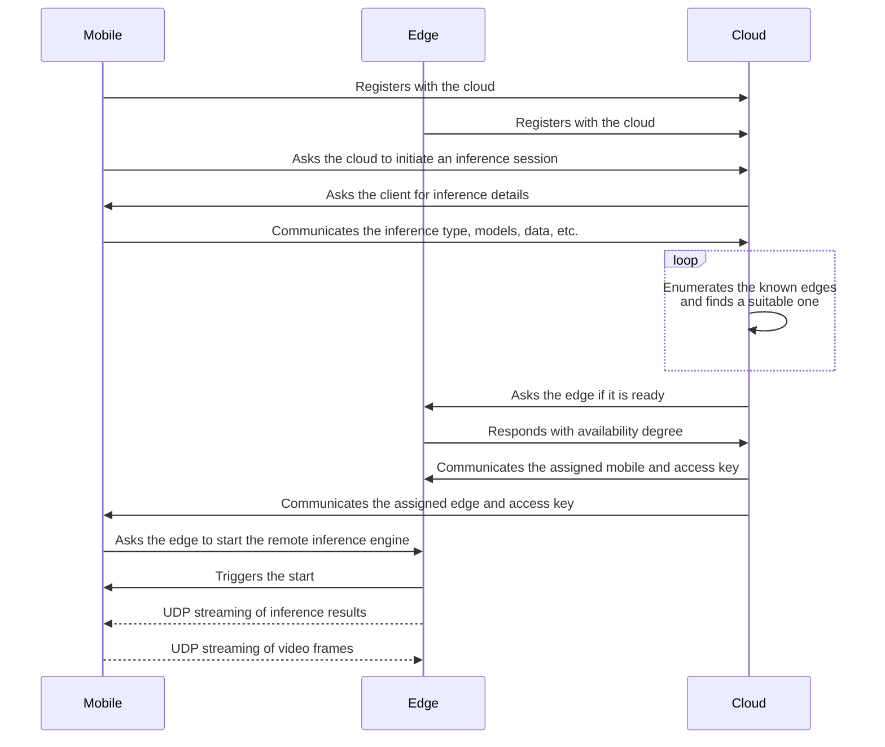
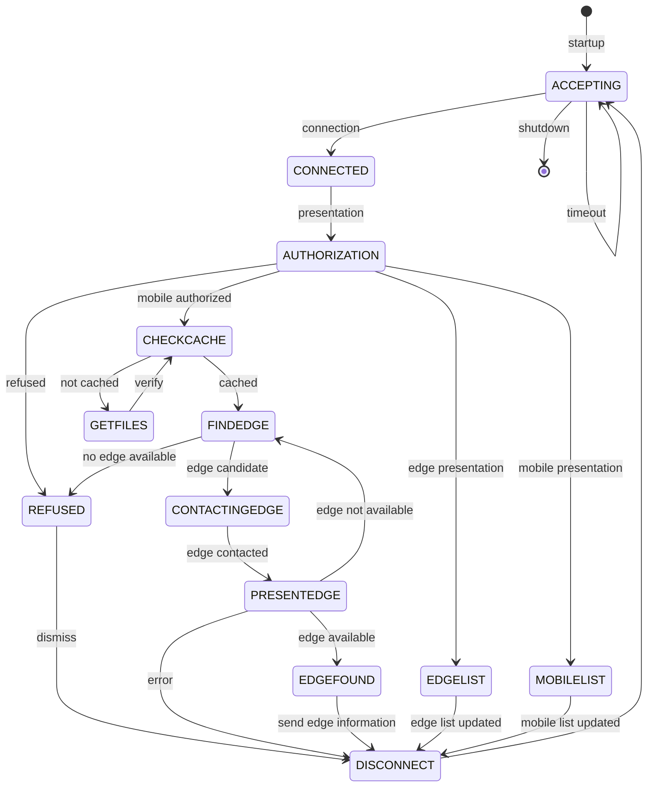
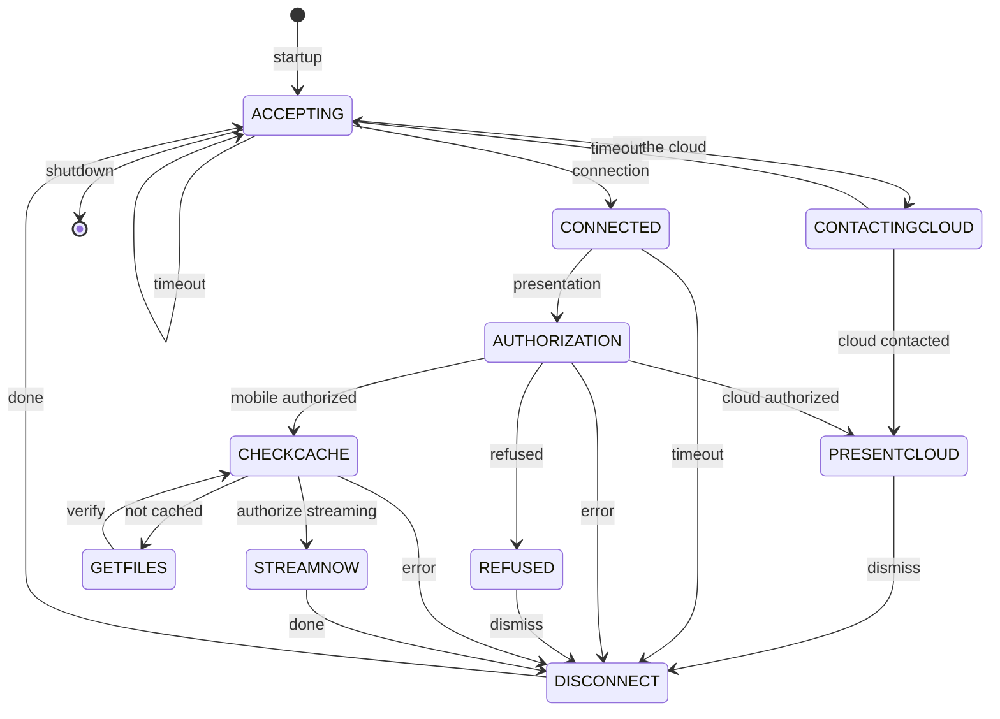
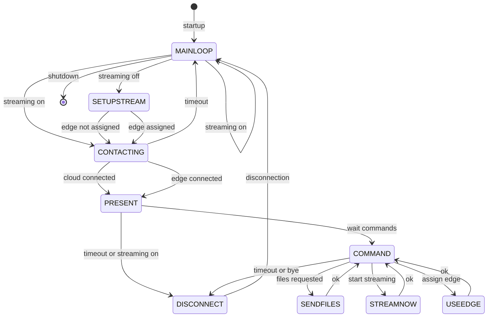
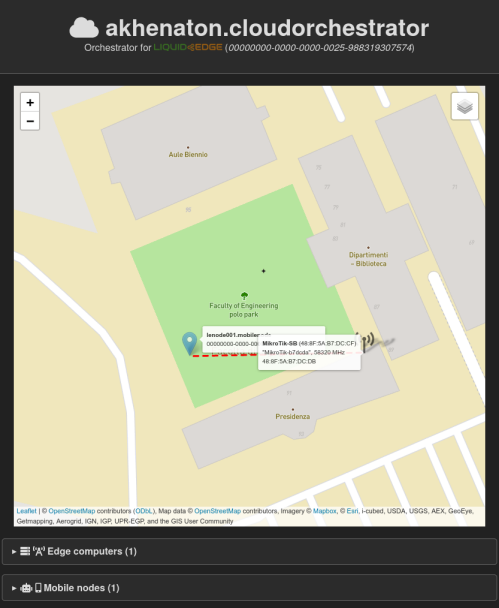
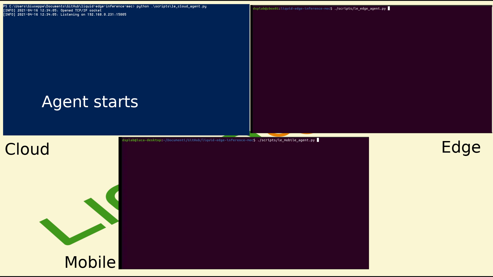

# LIQUID EDGE Inference Mobile Edge Computing Subsystem


> These programs are a part of the system used for the LIQUID EDGE PRIN 2017 project demonstrator.

The _liquid-edge-inference-mec_ programs ensemble v0.2.0 is used to setup and maintain the inference engines operated by _liquid-edge-ocv-cam-streamer_ v0.4 or by ROS nodes.

This ensemble is made by three separate Python agents that run in the cloud orchestrator, edge computers, and mobile nodes:

- **Cloud orchestrator agent (_le_cloud_agent.py_):** orchestrates the whole thing at the cloud side, and there should be only one running in your inference network;
    - it keeps an up-to-date list of available edge computers, together with their capabilities and status;
    - it is contacted by mobile nodes when they need to offload the computation to an edge computer;
    - it routes mobile nodes requests to the most (geographically or logically) appropriate edge computer;  
    - it has an HTTP-based web GUI for controlling the links and inference status;
- **Edge computer agent (_le_edge_agent.py_):** manages the inference engine at the edge side, there should be one running for each edge computer available in your inference network;
    - it keeps an up-to-date list of cloud orchestrators (indeed, just one) associated with the edge;
    - it accepts mobile node offloading requests and sets up the inference session operated by the streaming receiver;
    - it maintains a _keepalive_ connection with the mobile node agent, if requested to do so;
- **Mobile node agent (_le_mobile_agent.py_):** manages the inference engine at the mobile side, clearly there is one running in each mobile node;
    - it contacts a cloud orchestrator to request an edge computer for computational offloading;
    - it contacts an assigned edge computer to set up the inference session;
    - it maintains a _keepalive_ connection with the edge computer agent, if requested to do so.

An example inference network is pictured below, where we have one orchestrator, two edges, and three mobiles. The solid lines represent actual inference sessions during the computational offloading, while dashed ones represent the setup of the inference sessions. In this figure, mobile #1 and #2 offload to edge #1, whereas mobile #3 offloads to edge #2, maybe because edge #1 is no more accepting requests. Requests denial could be due to edge #2 not having the required model files in cache or inference engine available, and they cannot be easily provided, or that edge #1 has topped its computational power.


_Caching_ in the network is implemented in two different agents: at the cloud side and at the mobile side. Essentially, when the mobile contacts the cloud, the cloud might decide to ask for auxiliary file(s) used to sustain the inference session, and these files can be stored in the cloud cache.

Note that the files are hashed and can be shared by many clients, so any other mobile that uses the very same files can be relieved from offering them to the cloud, as they could be already in a cache.

Similarly, when the mobile has been assigned an edge, the file information exchange is repeated, and also the edge has the possibility to store in a local cache the auxiliary files (in hashed form). This leads to the possibility of implementing caching strategies that reduce the time needed to setup the inference sessions.

The three agents can be configured by YAML files. For instance, an example edge configuration file is shown below:

```yaml
# Configuration file for LIQUID⠪EDGE edge computer

# the edge properties
edge:

  # name of the agent: auto, or a specified name
  name: auto

  # management things
  management:

    # the management IP address or hostname
    address: 192.168.2.8

    # the management TCP/IP port, a number
    port: 15009

    # the maximum number of concurrent connections (currently not honored)
    max-connections: 1
  
  # streaming things
  streaming:

    # the streaming IP address or hostname (currently ignored)
    address: 

    # the streaming UDP/IP port, a number
    port: 15000

  # cache things
  cache:

    # local cache folder: auto ($TMPDIR/le_edge_cache), or a specified folder (will be created)
    folder: auto

  # radio access network
  ran:

    # 60 GHz monitored AP IP address 
    address: 192.168.0.81
    
    # Geographical coordinates of RAN
    coordinates:
      x: 43.118762
      y: 12.35595

  # the list of available engines - there may be many
  engines:

    # These placeholders are replaced by their real values
    # __key__      : access key value
    # __address__  : destination address
    # __port__     : destination port
    # __typeTYPE__ : file type

    # NOTE THAT PATH IS AN ARRAY (COMMANDS) OF ARRAY (COMMAND LINE ARGUMENTS)

    # plain ping (for tests)
    - name: ping
      path:
        -
          - /usr/bin/ping
          - __address__
      version:
      keepalive: true

    # C++ Open-CV
    - name: liquid-edge-ocv-cam-streamer
      path:
        -
          - ../liquid-edge-ocv-cam-streamer/bin/le_ocv_streamer_rx
          - -c=__typeCONFIG__
          - -w=__typeWEIGHTS__
          - -n
          - -o=3
          - -k=__key__
          - __address__:__port__
      version: 0.4.0
      keepalive: false

    # ROS node
    - name: ros-test
      path:
        -
          - /usr/bin/gnome-logs
          - --name=PIPPO
        -
          - /usr/bin/gnome-todo
          - --debug
      version:
      keepalive: true

# the cloud to contact
cloud:

  # the cloud IP address or hostname
  address: 192.168.2.8

  # the cloud TCP/IP port, a number
  port: 15005

  # the cloud access key
  access-key: tyC7L2vx
```

The configuration file sets up the edge computer engines that will be offered to the mobile nodes, declares the addresses of the RAN AP devices, defines the IP ports for session management and streaming, and configures a _keepalive_ connection. Similarly, also the cloud orchestrator and the mobile nodes can be set up for operation. For a more thorough description of the configuration files, browse the samples in the _config_ folder

## Operation details

The typical inference session is depicted in Fig. 1.


_Figure 1. Inference session setup._

Typical events in the session are:

1. Both the mobile client and the edge computer register with the cloud, to disclose their presence in the network.
2. When the mobile node needs an inference service, it contacts the cloud orchestrator.
3. The cloud agent asks the mobile agent for further inference details.
4. The mobile node communicates all possible details on the needed inference service.
5. The cloud agent looks for the most suited edge computer, which is able to serve the mobile node requests in a timely manner and satisfactorily.
6. The cloud orchestrator contacts the selected edge computer and asks for its availability to carry out the inference task.
7. The edge computer responds with the acceptance of the task, as well as giving further details.
8. The cloud generates an access token and communicates it to both the mobile and edge nodes: at this point, both nodes have knowledge of each other.
9. The mobile node officially triggers the inference service start on the edge computer side.
10. A streaming inference session is established between the two peers.

All messages (before the streaming session takes over) are exchanged using simple TCP/IP messages in JSON format.

For instance, a typical presentation message sent from the edge to the cloud is:

```json
{
  "subject": "EDGE",
  "ts": "2021-03-11 12:05:51.201455",
  "access-key": "tyC7L2vx",
  "body": {
    "address": [
      "192.168.0.205",
      15009
    ],
    "access-key": "lpl1qolu",
    "availability": 1,
    "uuid": "00000000-0000-0000-0043-120545814989",
    "name": "zbox01.edgecomputer",
    "hardware": {
      "cpus": [
        {
          "model": "Intel(R) Core(TM) i7-9750H CPU @ 2.60GHz",
          "arch": "x86_64",
          "load": 0.10300000000000001
        }
      ],
      "gpus": [
        {
          "model": "GeForce RTX 2070",
          "arch": "",
          "load": 0.1
        }
      ]
    },
    "engines": [
      {
        "name": "liquid-edge-ocv-cam-streamer",
        "version": "0.4.0"
      }
    ]
  }
}
```

The exchanged information covers:

* a timestamp;
* one or more access tokens and UUIDs;
* name, address, and control port of edge;
* availability degree;
* list of CPUs and their load;
* list of GPUs and their load;
* list of inference software engines available.


### Cloud orchestrator

The cloud orchestrator task is to collect and keep an up-to-date list of available edge computers, as well as to route the mobile nodes offloading requests to the most appropriate edge computer. It also shares a web GUI for an overview of the systems' operation. The state machine implemented in the cloud orchestrator is detailed in Fig. 2.


_Figure 2. Finite state machine of the cloud orchestrator._

### Edge computer

The following state diagram describes the protocol used to setup the inference engine at the edge computer side (Fig. 3).


_Figure 3. Finite state machine of the edge computer._

### Mobile node

The following state diagram (Fig. 4) describes the protocol used to setup the inference engine at the mobile node side.


_Figure 4. Finite state machine of the mobile node._

## Control panel ##

A web control panel (Fig. 5), accessed by any browser, runs in the cloud orchestrator (by default on port 15006), and allows to visualize on a 2D map the current link situation. This panel shows:

- a 2D street map with icons placed on the actual positions of the mobile node(s) and of the edge APs;
- a list of all registered edge computers, together with a summary of their characteristics, as well as the RF properties of the links activated between the edge AP and the stations. For the edge computer currently elected by the mobile node as offloading device, a view of the video stream is presented (the video includes the inference results, if enabled);
- a list of all the registered mobile nodes, with a summary of their characteristics, and with detailed information on the active links of all of its stations.



_Figure 5. Control panel._

## Test virtual GPS path

You can test a virtual _walk_ of the mobile by sending fake NMEA navigation messages into the serial port used by the mobile to read a real GPS device output.

In order to do this, there is an "_output.nmea_" file generated by https://www.nmeagen.org/, which you can send to the fake serial. First create a couple of ports for sending data to and reading data from, with

```bash
$ socat -d -d pty,raw,echo=0 pty,raw,echo=0
```

and read the serial port numbers which have been generated (in this case, **3** is for reading from and **4** for writing to)

```cli
...
2021/10/23 10:55:51 socat[353007] N PTY is /dev/pts/3
2021/10/23 10:55:51 socat[353007] N PTY is /dev/pts/4
2021/10/23 10:55:51 socat[353007] N starting data transfer loop with FDs [5,5] and [7,7]
...
```

Now, you can specify _/dev/pts/3_ as the serial port to use in the mobile YAML file. It is time to dump the NMEA data into the serial port, by using `yes` and `pv` to cycle through the file repeatedly, as in

```bash
$ yes "$(<scripts/output.nmea)" | pv -l -L 3 -q > /dev/pts/4
```

where the number after _-L_ decides the rate in bytes/s (I do not know if this limit, is obeyed, just try a small number and see what happens).

## Performance discussion

The short YouTube clip in Fig. 6 exemplifies the typical session, involving all the three agents (although it refers to a previous revision of this software, it gives an idea nonetheless).

[](https://youtu.be/r7v32NN3LZo "Three agents")
_Figure 6. Message exchange between the three agents._

Performance measurements cover the typical latency during all the different phases of the session setup. The measurements are done with the agents connected through the 60 GHz 802.11ad link (Table I).

_Table I. Performance summary._
| Description | Value |
|---|---|
| Mobile and edge nodes presentation to cloud | 1s | 
| Reconnect after disconnect | 6s |

## References

1. https://github.com/nathanrhart/Python-TCP-Server/blob/master/tcp_server.py
2. https://gist.github.com/Integralist/3f004c3594bbf8431c15ed6db15809ae
3. https://stackoverflow.com/questions/13979764/python-converting-sock-recv-to-string
4. https://stackoverflow.com/questions/64386571/python-tcp-socket-send-string
5. https://www.freecodecamp.org/news/how-to-substring-a-string-in-python/
6. https://stackoverflow.com/questions/275018/how-can-i-remove-a-trailing-newline
7. https://stackoverflow.com/questions/1131220/get-md5-hash-of-big-files-in-python
8. https://stackoverflow.com/questions/17667903/python-socket-receive-large-amount-of-data
9. https://www.pythonpool.com/python-delete-file/
10. https://docs.python.org/3/library/stdtypes.html?highlight=strip#str.strip
11. https://www.tutorialspoint.com/python-generate-random-string-of-given-length
12. https://docs.python.org/3/library/os.path.html
13. https://linuxize.com/post/python-check-if-file-exists/
14. https://www.csestack.org/get-file-size-python/
15. https://stackoverflow.com/questions/384076/how-can-i-color-python-logging-output
16. https://www.nmeagen.org/
17. https://superuser.com/questions/526242/cat-file-to-terminal-at-particular-speed-of-lines-per-second
